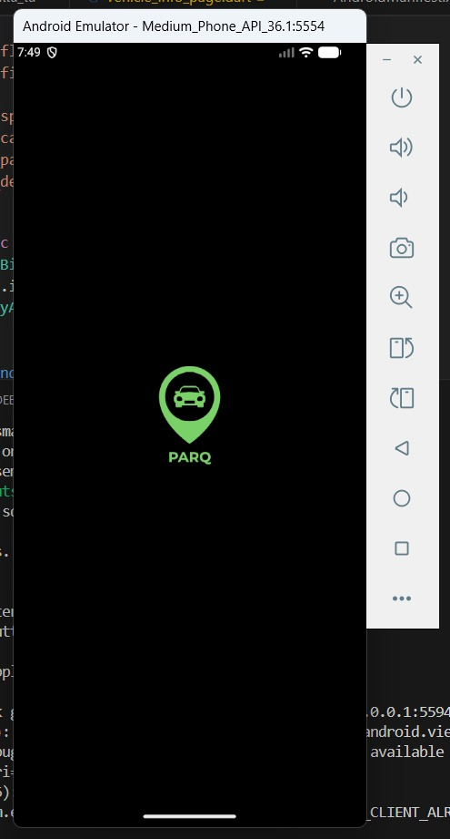
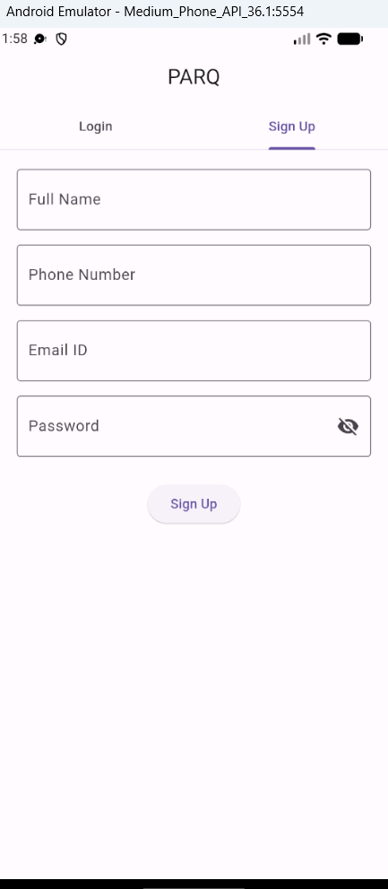
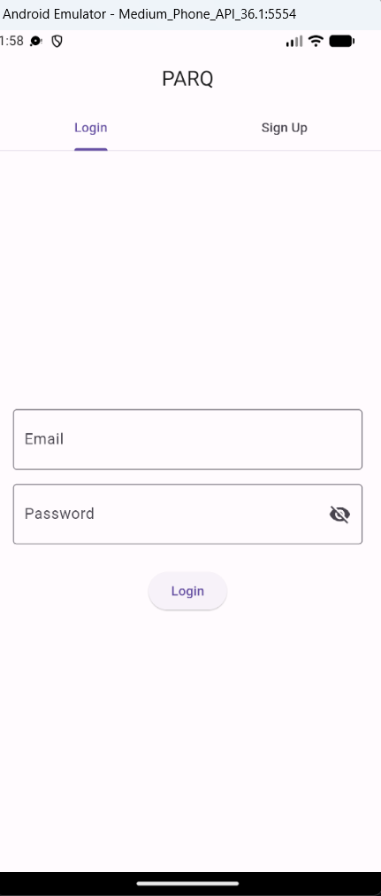
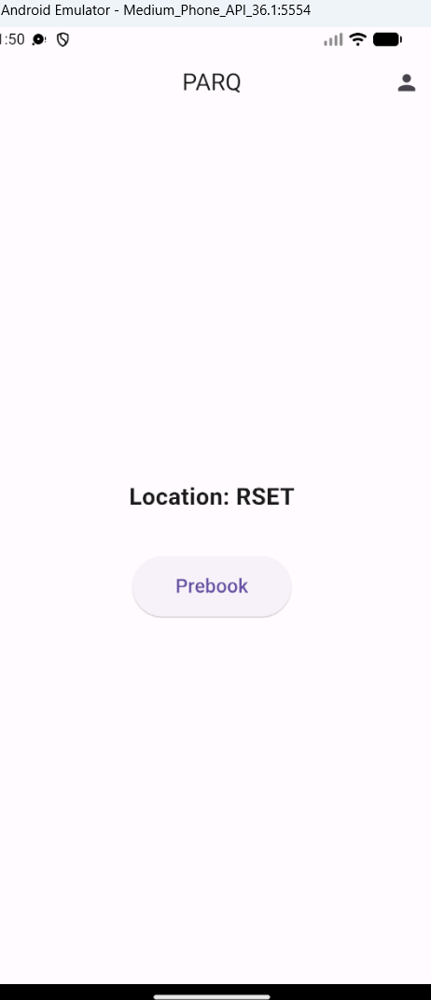
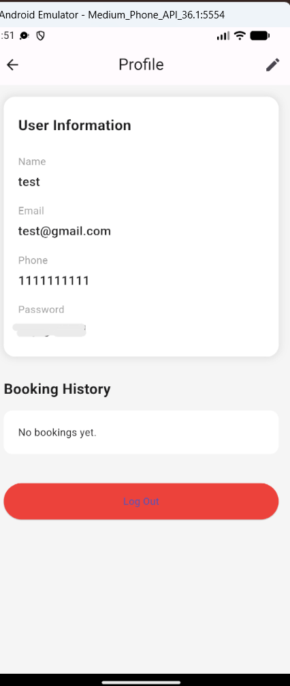
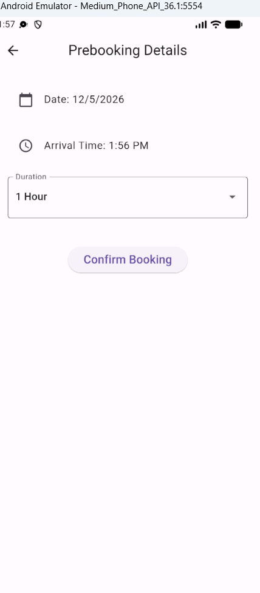
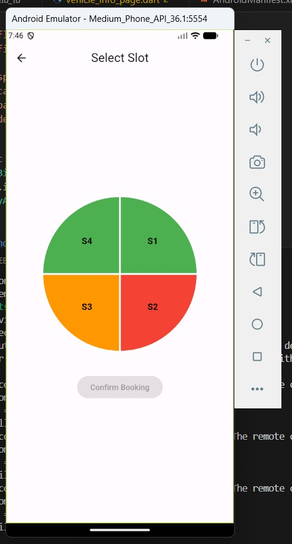
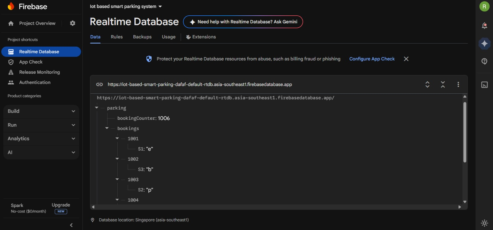
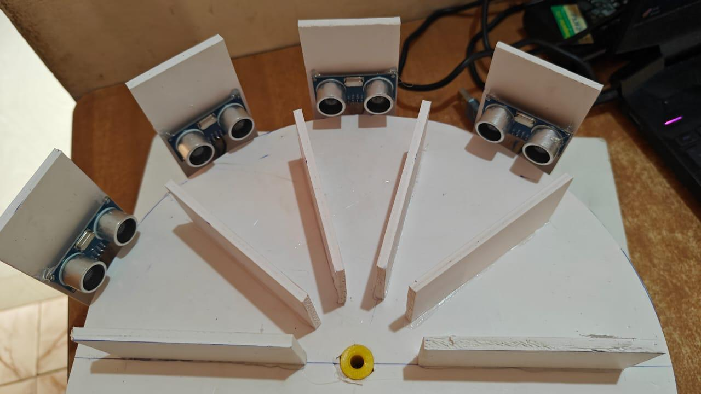

# PARQ — IoT Based Smart Parking System

A full-stack IoT smart parking system built as a third-year mini project.
PARQ allows users to pre-book parking slots via a mobile app, with real-time slot availability tracked by ultrasonic sensors and a servo motor-all synced through Firebase Realtime Database.

## Demo
## Hardware Working Model

[Click here to watch demo](working_vd.mp4)

## App Screenshots

| Logo | Sign Up | Login | Home |
|---|---|---|---|
|  |  | | 

| Profile | Slot Map | Booking Details |
|---|---|---|
| |  |  

## Hardware & Backend

| Firebase Database | Hardware Model |
|---|---|
|  |  |

## Features

- Pre-book parking slots through the PARQ mobile app
- Login/Sign up to book
- Profile page with user details, booking history and edit option
- Enter booking details — date and time
- Booking confirmation screen 
- Real-time slot availability displayed on an interactive map (green = available, orange = booked, red = occupied, yellow= selected)
- Firebase Realtime Database syncs app bookings to hardware instantly
- Arduino reads booking data and operates servo motor for correct slot selection
- Ultrasonic sensors detect vehicle occupancy and update slot status in real time

## System Architecture  
```
PARQ Mobile App (Flutter)
        |
        | (Read/Write)
        ▼
Firebase Realtime Database
        |
        | (Stream)
        ▼
ESP8266 (Wi-Fi Bridge)
        |
        | (Serial - UART)
        ▼
Arduino Uno
        |
        |---> Servo Motor (Gate Control)
        |---> 4x HC-SR04 Ultrasonic Sensors (Occupancy Detection)
```
## Tech Stack

| Layer | Technology |
|---|---|
| Mobile App | Flutter (Dart) |
| Backend / Database | Firebase Realtime Database |
| Wi-Fi Microcontroller | ESP8266 |
| Hardware Controller | Arduino Uno |
| Sensors | HC-SR04 Ultrasonic (x4) |
| Actuator | Servo Motor |
| Communication | UART Serial (Arduino ↔ ESP8266) |

## Hardware Components

- Arduino Uno
- ESP8266 Wi-Fi Module
- 4x HC-SR04 Ultrasonic Sensors
- Servo Motor (MG995)
- Jumper wires
- Custom foam board parking model

## How It Works

- User opens PARQ app and selects a date, time, and available slot
- Booking is saved to Firebase Realtime Database
- ESP8266 streams the booking data and sends it to Arduino via serial
- Arduino receives the booking and rotates the servo motor to the booked slot position
- Ultrasonic sensor detects when a vehicle enters the slot
- Arduino sends occupancy status back to ESP8266
- ESP8266 updates Firebase — slot status reflects on the app in real time

## Project Structure

```
IOT-Smart-Parking-parq/
├── parking_controller.ino      # Arduino: sensor reading + servo gate control
├── firebase_bridge.ino         # ESP8266: Firebase streaming + serial communication
├── app/                        # Flutter mobile app source code
├── logo_app.jpeg               # PARQ app logo
├── login_img.png               # App login screen
├── signup_img.png              # App signup screen
├── prebookpg_img.png           # App home/prebook screen
├── prebookdetails_img.png      # App booking details screen
├── map_app.jpeg                # App slot map screen
├── profile_img.png             # App profile screen
├── firebase_database.jpeg      # Firebase database screenshot
├── hardware_img.jpeg           # Hardware model photo
└── working_vd.mp4              # Hardware demo video
```

## Setup & Installation

### Hardware

1. Connect HC-SR04 sensors to Arduino:
   - Sensor 1: Trig = 3, Echo = 4
   - Sensor 2: Trig = 6, Echo = 7
   - Sensor 3: Trig = 8, Echo = 9
   - Sensor 4: Trig = 11, Echo = 12
   - VCC → 5V, GND → GND
2. Connect servo motor to pin 9
3. Connect ESP8266 to Arduino via SoftwareSerial:
   - ESP TX → Arduino RX (pin 12)
   - ESP RX → Arduino TX (pin 13)
4. Upload `parking_controller.ino` to Arduino Uno
5. Replace credentials in `firebase_bridge.ino` and upload to ESP8266

### Firebase

- Create a Firebase project at console.firebase.google.com
- Enable Realtime Database
- Copy your API key and database URL into firebase_bridge.ino

### Flutter App

- Clone the repo and navigate to the app/ folder
- Add your google-services.json to app/android/app/
- Run flutter pub get
- Run flutter run

## Limitations & Future Scope

- Requires stable Wi-Fi connectivity for real-time sync
- Current prototype optimized for model scale; sensor calibration needed for real parking dimensions
- Single location support — multi-location integration planned
- Email verification for secure user authentication (planned)
- Dedicated entry/exit gate system to be integrated
- Future features planned: EV charging slot booking, car wash options, license plate recognition

## Team

| Member | Primary Role |
|---|---|
| Riddhi Gopikrishnan | Flutter Mobile App Development and Firebase Set Up |
| Member 2 | Arduino Hardware & Firmware |
| Member 3 | ESP8266 Firebase Integration |
| Member 4 | Hardware Model & Circuit Design |

> Note: All members contributed across hardware and software components.

## Built With

Flutter · Firebase · Arduino · ESP8266 · Dart

